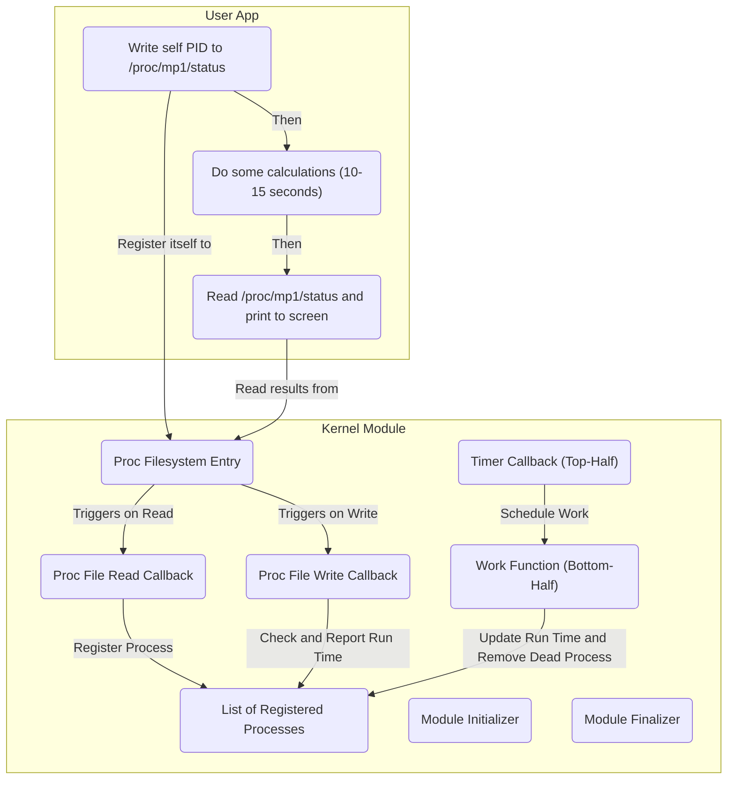

# CS423 Fall 2023 MP1: Introduction to Linux Kernel Programming

**Assignment Due**: Sep. 29th at 11:59 PM CT

**Last Updated**: Sep. 7th

This document will guide you through your MP1 for CS 423 Operating System Design. In this MP, you will learn how to create a Linux kernel module from sketch.

This MP will require you to read, write and debug C-based kernel code in depth. It may take you **several days** to complete.

# Table of Contents

* [Overview](#overview)
* [Before your start](#before-you-start)
* [Problem Description](#problem-description)
* [Implementation Challenges](#implementation-challenges)
* [Implementation Overview](#implementation-overview)
* [Note on Code Quality](#note-on-code-quality)
* [Compile and Test Your Code](#compile-and-test-your-code)
* [Submit Your Result](#submit-your-result)

# Overview 

### Goals

- In this Machine problem you will learn the basics of Linux Kernel Programming
- You will learn to create a Linux Kernel Module (LKM).
- You will use Timers in the Linux Kernel to schedule work
- You will use Work Queues to defer work through the use of the Two-Halves concept
- You will use the basics of the Linked Lists interface in the Linux Kernel to temporarily store data in the kernel
- You will learn the basic of Concurrency and Locking in the Linux Kernel
- You will interface applications in the user space with your Kernel Module through the Proc Filesystem

# Before you start

### What you need

- You should have successfully completed MP0, as you may wish to test your kernel module using the virtual machine created in MP0.
- You should be able to read, write and debug program codes written in C language.
- (Recommended) You may have a code editor that supports Linux kernel module development - for example, VSCode, Neovim, or GNU Emacs.
- (Recommended) You may use the Linux Kernel Documentation (https://www.kernel.org/doc/html/v5.15/index.html) to search the Linux kernel documents for concepts and high-level descriptions.
- (Recommended) You may use the Elixir Cross Referencer (https://elixir.bootlin.com/linux/v5.15.127/source) to search the Linux kernel codebase for function definitions and use cases.

### Introduction

Kernel Programming has some particularities that can make it more difficult to debug and learn. In this section we will discuss a few of them:

1. The most important difference between kernel and user application programming in Linux is the lack of isolation. The kernel itself and all kernel modules are running in the same context. This means that errors encountered in the kernel (e.g., trying to dereference a null pointer) can cause kernel panics - making your entire kernel to stop working - or even brick your whole machine in the worst case. Therefore, when testing your code, we strongly recommend you do so in a virtual machine.

2. Another important difference is that in kernel programming, preemption is not always available, that means that we can indefinitely hog the CPU or cause system-wide deadlocks. At the user level, an infinite loop might just increase your CPU usage. But in the kernel, such a loop could potentially put your whole machine into an unresponsive state. So when you are using loops or locks, please make sure they can always end/release in time.

3. Also another important issue is the lack of user space libraries. Although there are some common libc functions implemented in kernel, such as `memcpy` or `abs`, you'll find more functions are only available in an alternative form, such as `malloc` (kernel uses `kmalloc`) or `printf` (kernel uses `printk`). Worse, some functions are not available in kernel at all, such as `scanf`. This limits what we can do and how do we implement it.

4. Last but not least, Linux Kernel disallows the use of floating-point types and operations. That is all the math must be implemented using integer types (i.e. `int`, `long`, or `char`).

Through the rest of the document and your implementation you will learn some of the basic mechanisms, structures and designs common to many areas of Linux Kernel Development. If you feel lost, the best thing to do is to check the Linux Kernel Documentation (https://www.kernel.org/doc/html/v5.15/index.html) or the Elixir Cross Referencer (https://elixir.bootlin.com/linux/v5.15.127/source) - they are your most useful encyclopedia and dictionary in kernel development. Also, Stack Overflow, LWN.net and O'Reilly Media can sometimes provide you with some useful information.

# Problem Description

In this MP you will build a kernel module that measures the User Space CPU Time of processes. The kernel module should allow **multiple** processes to register themselves as targets of measurement and later query their CPU Time usage. You will also need to create a user-space program to test your kernel module implementation.

Grading Criteria (**Total Possible Points: 100%**):

1. The kernel module and user program will be tested in a VM environment prepared according to the MP0 guide. Multiple instances of user program may run concurrently to test if multi-process tracking is functional in your kernel module.

2. Create a file in the Proc Filesystem. This file is the interface for user programs to interact with your kernel module. You must use the Kernel Proc Filesystem API to create the file and handle read/write requests. The Proc file should be available at `/proc/mp1/status`. It should be readable and writable by anyone (file permission should be 0666). (interfaces defined in `linux/proc_fs.h`) (**10%**)

3. When a process writes a PID (Process Identifier) into the Proc file, the process corresponding to the PID should be registered in the module for User Space CPU Time measurement. Multiple PIDs may be registered. The written message be a decimal string, which contains the PID. (**10%**)

4. When a process reads the Proc file, the file should return a list of registered processes together with their corresponding User Space CPU Time (known also as user time), with the following format: (**10%**)

   ```console
   <PID1>: <CPU Time of PID1>
   <PID2>: <CPU Time of PID2>
   ...
   ```

   For example:

   ```console
   423: 10002
   523: 99999
   623: 1002222
   ```

5. The kernel module should keep the list of registered process and their user time in memory and update them every 5 seconds.

   1. You must use Kernel Linked List to implement the list and add/remove/iteration functionalities. (interfaces defined in `linux/list.h`) (**10%**)
   2. You must use the Kernel Timer to implement the periodic update functionality. (interfaces defined in `linux/timer.h`) (**10%**)
   3. You must use the Two-Halves Approach to handle the timer interrupt, and implement it using Kernel Workqueue. Which means when your timer is fired, you timer callback function should use Kernel Workqueue to schedule an user time update work (Top-Half). The user time update work should, when exiting the Workqueue, iterate the registered process list and update the user time (Bottom-Half). (interfaces defined in `linux/workqueue.h`) (**5%**)
   4. You must use Kernel Mutexes to protect your process list from any race condition. (interfaces defined in `linux/mutex.h`) (**5%**)
   5. You must use Kernel Slab Allocator to allocate and free memory. (interfaces defined in `linux/slab.h`) (**5%**)
   6. Your kernel module should be able to detect the liveness of processes and remove dead/exited processes from the registered process list. (**5%**)
   7. It is acceptable for your work function to be scheduled even if there are no registered processes.

6. Your kernel module should be able to release all the resources it acquired and exit gracefully when being unloaded.  (**10%**)

7. Your code is well commented, readable, warning-free, has a completed README file, and follows software engineering principles. (**10%**)

8. Your user-space program can register itself using the Proc file exposed by your kernel module. It should spend about 10-15 second on some calculations, read the Proc file and print the content it read, and then exit. (**10%**)

# Implementation Challenges

In this MP you will find many challenges commonly found in Kernel Programming. Some of these challenges are discussed below:

- During the registration process you will need to **access data from the User Space**. Kernel and User-Space Applications run in **two separate memory spaces**, so de-referencing pointers containing data from the User Space is not possible. Instead you must use the function `copy_from_user()` to copy the data into a buffer located in kernel memory. Similarly, when returning data through a pointer we must copy the data from the kernel space into the user space using the function `copy_to_user()`. Common cases where this might appear are in Proc filesystem callbacks and system calls.
- Another important challenge is the lack of libraries, instead the kernel provides similar versions of some commonly used functions found in libraries. For example `malloc()` is replaced with `kmalloc()`, `printf()` is replaced by `printk()`. Some other handy functions implemented in the kernel are `snprintf()`, and `kstrtoint()`.
-  Throughout your implementation, you will need to face **different running contexts**. A context is the entity whom the kernel is running code on behalf of. In the Linux kernel you will find 3 different contexts:
  1. Kernel Context: Runs on behalf of the kernel itself. Example: Kernel Threads and Workqueues.
  2. Process Context: Runs on behalf of some process. Example: System Calls.
  3. Interrupt Context: Runs on behalf of an interrupt. Example: Timer Interrupt.
- The Linux kernel is a **preemptible kernel**. This means that all the contexts run **concurrently** and can be interrupted from its execution at any time. You will need to protect your data structures through **the use of appropriate locks** and prevent race conditions wherever they appear. Please note that architectural reasons limit which type of locks can be used for each context. For example, interrupt context code cannot sleep and therefore semaphores will create a deadlock when used in this case.
- This sleeping restriction in interrupt context also prevents you from using various functions that sleep during its execution. Many of these functions involve complicated operations that require access to devices like `printk()`, functions that schedule processes, copy data from and to the user space, and functions that allocate memory.

Due to all these challenges, we recommend you that you test your code often and build in small increments. You can use the `WARN_ON()` macro as assertion, or use `pr_warn()` function to print some debug messages.

# Implementation Overview

In this section we will briefly guide you through the implementation. The figure below shows the architecture of MP1, showing the kernel module with its Workqueue and Timer and also the Proc Filesystem all in the kernel space. In the user space you can see the test application that you will also implement.




**Step 1:** Please start from the Hello World module available in your submission repo on GitHub classroom. Please edit the `MODULE_AUTHOR` line first. **You can find the starter code in `mp1.c` of your GitHub submission repository.**

**Step 2:** You should implement the **Proc Filesystem entries** (i.e `/proc/mp1/status`). You need to create a Proc Filesystem folder `/proc/mp1` first and then create the file `/proc/mp1/status`. Make sure that you implement the creation of these entries in your module `init()` function and the destruction in your module `exit()` function. At this point you should probably test your code. Compile the module and load it in memory using `insmod`. You should be able to see the Proc Filesystem entries you created using `ls`. Now remove the module using `rmmod` and check that the entries are properly removed. You will need to include the Proc Filesystem header file using `#include <linux/proc_fs.h>`.

**Step 3:** The next step should be to implement the **process registration**. You will need to declare and initialize a Kernel Linked List. The kernel provides macros and functions to traverse the list, and insert and delete elements. These definitions are available to be included using `#include <linux/list.h>`. To allocate nodes for your list, you may want to use the Slab Allocator. Definitions for Slab Allocator are available in `linux/slab.h`.

**Step 4:** You will also need to implement the **callback functions for read and write** in the entry of the Proc Filesystem you created. Keep the format of the registration string simple. It should be a decimal string able to be parsed by the `kstrtoint()` function. We suggest that a user space application should be able to register itself by simply writing the PID to the Proc Filesystem entry you created (e.g `echo "423" > /proc/mp1/status`). The callback functions will read and write data from and to the user space so you need to use `copy_from_user()` and `copy_to_user()`. You may just echo back the PID recorded at this stage. You can use `snprintf()` to format a string.

**Step 5:** At this point you should be able to write a **simple user space application that registers itself** in the module. Your test application can use the function `getpid()` to obtain its PID. You can open and write to the Proc Filesystem entry using `fopen()` and `fprintf()`. You can read the entry using `getc()` and `putc()`. Your program should run for at least 10 seconds so that the kernel module can update the user time for it. **You can find the starter code in `userapp.c` of your GitHub submission repository.**

**Step 6:** The next step should be to create a **Linux Kernel Timer** that wakes up every 5 seconds. Timers in the kernel are **single shot** (i.e not periodic). Expiration times for Timers in Linux are expressed in **jiffies** and they refer to an absolute time since boot. Jiffy is a unit of time that expresses the number of clock ticks of the system timer in Linux. The conversion between seconds and jiffies is system dependent and can be done using the constant `HZ` (i.e. `2 * HZ = number of jiffies in 2 seconds`). The global variable `jiffies` can be used to retrieve the current time elapsed since boot expressed in jiffies. Definitions for Kernel Timer are available in `linux/timer.h`.

**Step 7:** Next you will need to implement the **work function**. At the timer expiration, the timer handler must use the Workqueue API to schedule the work function to be executed as soon as possible. To test your code you can use `printk()` to print to the console every time the work function is executed by the workqueue worker thread. You can see these messages by using the command `dmesg` in the command line. Definitions for Kernel Workqueue are available in `linux/workqueue.h`.

**Step 8:** Now, you will need to implement the **updates to the CPU Times** for the processes in the Linked List. You may use the helper function `int get_cpu_use(int pid, unsigned long* cpu_value)` as a starting point. **The function is available in `mp1_given.h` of your GitHub submission repository.** This function returns `0` if the value was successfully obtained and returned through the parameter `cpu_value`, otherwise it returns `-1`. As part of the update process, you will need to use locks (definitions available in `linux/mutex.h`) to protect the Linked List and any other shared variables accessed by the three contexts (kernel, process, interrupt context). The advantage of using a two half approach is that in most cases the locking will be placed in the **work function** and not in the timer interrupt. If a registered process terminates, `get_cpu_use` will return `-1`. In this case, the registered process should be removed from the linked list.

**Step 9:** Finally you should check for **memory leaks** and make sure that everything is **properly released** before the module is unloaded. Please keep in mind that you need to stop any asynchronous entity running (e.g Timers, Workqueues, etc.) before releasing other resources. At this point, your kernel module should be largely done. Now you can implement the test application and have some additional testing of your code.

# Note on Code Quality

Please note that the code quality of each MP will also affect your grade. In MP1, code quality accounts for 10% of the total score.

You can read about the Linux Kernel's requirements for code quality here: https://www.kernel.org/doc/html/v5.15/process/4.Coding.html

For MP, we use a relaxed version of the Kernel Code Quality Guideline for grading. For example, we require:

- Your code should not trigger compiler warnings.
- Properly protect all multithreaded resources with locks.
- Abstract the code appropriately and use functions to split the code.
- Use meaningful variable and function names.
- Write comments for non-trivial codes.

We DO NOT require, but encourage you to:

- Follow the kernel's code styling guideline (https://www.kernel.org/doc/html/v5.15/process/coding-style.html)
- Compile your code with `-W` / `-Wall` flag.

Here are some advices:

- Your code should include comments where appropriate. It is not a good idea to repeat what the function does using pseudo-code, but instead, provide a high-level overview of the function including any preconditions and post-conditions of the algorithm. Some functions might have as few as one line comments, while some others might have a longer paragraph.

- Also, your code must be split into functions, even if these functions contain no parameters. This is a common situation in kernel modules because most of the variables are declared as global, including but not limited to data structures, state variables, locks, timers and threads.

- An important problem in kernel code readability is to know if a function holds the lock for a data structure or not, different conventions are usually used. A common convention is to start the function with the character `_` if the function does not hold the lock of a data structure.

- In kernel coding, performance is a very important issue; usually the code uses macros and preprocessor commands extensively. Proper use of macros and identifying possible situations where they should be used is important in kernel programming.

- Finally, in kernel programming, the use of the `goto` statement is a common practice. A good example of this, is the implementation of the Linux scheduler function `schedule()`. In this case, the use of the `goto` statement improves readability and/or performance. “Spaghetti code” is never a good practice.

# Compile and Test Your Code

Despite the best option to compile the kernel module is to do it in your MP0 VM, if you find building it takes too long, you may considering modifying the Makefile and build your module on your host Linux machine.

If you want to compile the kernel module outside of the MP0 VM, you may edit the Makefile to point to the correct kernel folder:

```Makefile
obj-m += mp1.o

all:
        make -C <PATH_TO_YOUR_5.15.127_KERNEL> M=$(PWD) modules
        gcc -o userapp userapp.c

clean:
        make -C <PATH_TO_YOUR_5.15.127_KERNEL> M=$(PWD) clean
        $(RM) userapp
```

For example:

```Makefile
obj-m += mp1.o

all:
        make -C ~/linux-5.15.127 M=$(PWD) modules
        gcc -o userapp userapp.c

clean:
        make -C ~/linux-5.15.127 M=$(PWD) clean
        $(RM) userapp
```

To test your kernel module, you can try loading, unloading, and running it in the MP0 VM. The following commands may be helpful:

```command
# inserting kernel module
insmod mp1.ko

# removing kernel module
rmmod mp1.ko

# registering PID 1 to the module
echo "1" > /proc/mp1/status

# listing current processes and user times
cat /proc/mp1/status

# print the kernel debug/printed messages
dmesg
```

# Submit Your Result

Here are the steps to accept and submit your MP.

- Open the link https://classroom.github.com/a/P4KJTn7f and login using your GitHub account.

- Find your name in the student list and click it to accept the assignment. Please double-check your name and email address before accepting the assignment (If you choose other’s name by mistake, please contact TA).
- A repo named `cs423-uiuc/mp1-<GitHubID>` will be automatically created for you with the starter code in it.
- Your kernel module must be compiled to `mp1.ko`, and your test application must be compiled to `userapp`. Push your code to your repo before the deadline. We will grade your last commit before the deadline.
- Please also edit the `README` file to briefly describe how you implement the functionalities. e.g. how the user interacts with the kernel module with Proc File System, how you store process information using kernel list, how you implement periodical tasks using Timer and Workqueue, etc. If you have some special implementation you think worth mentioning, please also include that. Don’t make it too long, your description doesn’t need to be very detailed. Please upload the `README` to your GitHub repo.
