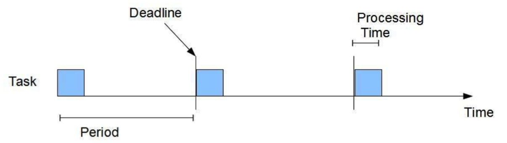
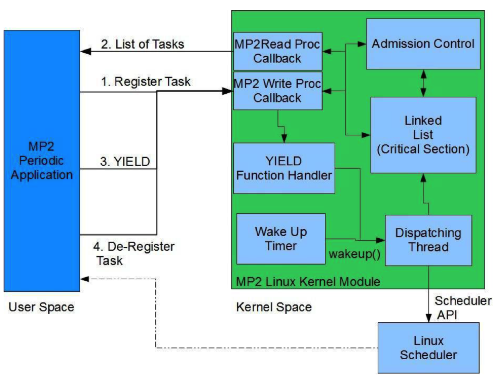

# CS423 Fall 2023 MP2: Rate-Monotonic CPU Scheduling

**Assignment Due**: Oct. 25th at 11:59 PM CT

**Last Updated**: Sep. 29th

# Table of Contents

- [CS423 Fall 2023 MP2: Rate-Monotonic CPU Scheduling](#cs423-fall-2023-mp2-rate-monotonic-cpu-scheduling)
- [Table of Contents](#table-of-contents)
- [Overview](#overview)
    - [Goals](#goals)
- [Before you start](#before-you-start)
    - [What you need](#what-you-need)
    - [Compile and Test Your Code](#compile-and-test-your-code)
- [Introduction](#introduction)
- [Problem Description](#problem-description)
  - [Implementation Challenges](#implementation-challenges)
  - [Implementation Overview](#implementation-overview)
      - [1. Start](#1-start)
      - [2. Proc Filesystem](#2-proc-filesystem)
      - [3. Process Control Block](#3-process-control-block)
      - [4. Registration](#4-registration)
      - [5. De-registration](#5-de-registration)
      - [6. Wake Up and Preemption Mechanisms](#6-wake-up-and-preemption-mechanisms)
        - [6a. Implementing the Dispatching Thread](#6a-implementing-the-dispatching-thread)
        - [6b. Implementing the Wake Up Timer Handler](#6b-implementing-the-wake-up-timer-handler)
      - [7. Implementing the YIELD Handler](#7-implementing-the-yield-handler)
      - [8. Implementing Admission Control](#8-implementing-admission-control)
      - [9. Memory De-allocation](#9-memory-de-allocation)
      - [10. Testing](#10-testing)
- [Note on Code Quality](#note-on-code-quality)
- [Submit Your Result](#submit-your-result)
- [Grading Criteria](#grading-criteria)

# Overview

### Goals

- In this MP you will learn the basics of Real-Time CPU Scheduling
- You will develop a Rate Monotonic Scheduler for Linux using Linux Kernel Modules
- You will implement bound-based Admission control for the Rate Monotonic Scheduler
- You will learn the basic kernel API of the Linux CPU Scheduler
- You will use the slab allocator to improve performance of object memory allocation
  in the kernel
- You will implement a simple application to test your Real-Time Scheduler

# Before you start

### What you need

- You should have successfully completed MP1, MP2 will use Proc Filesystem, Timers and List which were introduced in MP1.
- You should be able to read, write and debug program codes written in C language.
- (Recommended) You may have a code editor that supports Linux kernel module development - for example, VSCode, Neovim, or GNU Emacs (or Nano).
- (Recommended) You may use the [Linux Kernel Documentation](https://www.kernel.org/doc/html/v5.15/index.html) to search the Linux kernel documents for concepts and high-level descriptions.
- (Recommended) You may use the [Elixir Cross Referencer](https://elixir.bootlin.com/linux/v5.15.127/source) to search the Linux kernel codebase for function definitions and use cases.


### Compile and Test Your Code

Despite the best option to compile the kernel module is to do it in your MP0 VM, if you find building it takes too long, you may considering modifying the Makefile and build your module on your host Linux machine.

If you want to compile the kernel module outside of the MP0 VM, you may edit the Makefile to point to the correct kernel folder:

```Makefile
KERNEL_SRC:= <PATH_TO_YOUR_5.15.127_KERNEL>
SUBDIR= $(PWD)
GCC:=gcc
RM:=rm

.PHONY : clean

all: clean modules app

obj-m:= mp2.o

modules:
	$(MAKE) -C $(KERNEL_SRC) M=$(SUBDIR) modules

app: userapp.c userapp.h
	$(GCC) -o userapp userapp.c

clean:
	$(RM) -f userapp *~ *.ko *.o *.mod.c Module.symvers modules.order
```

For example:

```Makefile

KERNEL_SRC:= ~/linux-5.15.127
SUBDIR= $(PWD)
GCC:=gcc
RM:=rm

.PHONY : clean

all: clean modules app

obj-m:= mp2.o

modules:
	$(MAKE) -C $(KERNEL_SRC) M=$(SUBDIR) modules

app: userapp.c userapp.h
	$(GCC) -o userapp userapp.c

clean:
	$(RM) -f userapp *~ *.ko *.o *.mod.c Module.symvers modules.order
```

To test your kernel module, you can try loading, unloading, and running it in the MP0 VM. The following commands may be helpful:

```command
# inserting kernel module
insmod mp2.ko

# removing kernel module
rmmod mp2.ko

# print the kernel debug/printed messages
dmesg
```

# Introduction

Several systems that we use every day have requirements in terms of **response time** (e.g. delay and  jitter) and **predictability** for the safety or enjoyment of their users. For example a surveillance system needs to record video of a restricted area, the video camera must capture a video frame every 30 milliseconds. If the capture is not properly scheduled, the video quality will be severely degraded.

For this reason, the Real-Time systems area has developed several algorithms and models to provide this precise timing guarantees as close to mathematical certainty as needed. One of the most common models used is the **Periodic Task Model**.

[](figs/figure1.png)
*Figure 1: Liu and Layland Periodic Task Model*

A Periodic Task as defined by the [Liu and Layland model](https://experts.illinois.edu/en/publications/generalized-rate-monotonic-scheduling-theory-a-framework-for-deve) is a task in which a job is released after every period P, and must be completed before the beginning of the next period, referred to as deadline D. As part of the model, each job requires certain processing time C. Figure 1 illustrates this model. In this MP you will develop a CPU scheduler for the Liu and Layland Periodic Task Model. The scheduler will be based on the **Rate-Monotonic Scheduler (RMS)**. The RMS is a static priority scheduler, in which the priorities are assigned based on the period of the job: the shorter the period, the higher the priority. This scheduler is preemptive, which means that a task with a higher priority will always preempt a task with a lower priority until its processing time has been used.

# Problem Description

In this module, we'll implement a Real-Time CPU scheduler based on the **Rate-Monotonic Scheduler (RMS) for a Single-Core Processor**. Our implementation will be in the form of a **Linux Kernel module**. For communication between the scheduler and user-space applications, we'll utilize the Proc filesystem. Specifically, we'll use a **single Proc filesystem entry** for all interactions: `/proc/mp2/status`, which should be readable and writable by any user. Our scheduler will support the following three operations through the Proc filesystem:

- **Registration**: This operation allows the application to inform the Kernel module of its intent to use the RMS scheduler. The application provides its registration parameters to the kernel module (*PID, Period, Processing Time*).
- **Yield**: This operation signals the RMS scheduler that the application has completed its period. After yielding, the application will *block until the next period*.
- **De-Registration**: This operation lets the application inform the RMS scheduler that it has *finished* using the RMS scheduler.

Our Rate-Monotonic scheduler will register a new periodic application only if the application's scheduling parameters clear the *admission control*. The admission control determines if the new application can be scheduled alongside other already admitted periodic applications without any deadline misses for the registered tasks. The admission control must be a function within your kernel module. *Your scheduler should not account for cases where the application uses more than the reserved Processing Time (Overrun Cases)*.

This scheduler will depend on the Linux Scheduler for context switching. Hence, the Linux Scheduler API should be used. No need to handle any low-level operations. Refer to sections [`implementation-challenges`](#implementation-challenges) and [`implementation-overview`](#implementation-overview) for deeper insights.

Additionally, an application running in the system should be able to query which applications are registered and also query the scheduling parameters of each registered application. When the entry (`/proc/mp2/status`) is read by an application, the kernel module must return a list with the PID, Period, and Processing Time of each application in the following format:

```
<pid 1>: <period 1>, <processing time 1>
<pid 2>: <period 2>, <processing time 2>
...
<pid n>: <period n>, <processing time n>
```

You will also develop a simple test application for our scheduler. This application will be a single-threaded periodic application with individual jobs doing some computations. It must do the following in order:

1. This periodic application must register itself with the scheduler (through admission control). During the registration process, it must specify its scheduling parameters: The Period of the jobs expressed in milliseconds and Processing Time of each job also expressed in milliseconds.

2. After the registration, the application must read the `/proc/mp2/status` entry to ensure that its PID is listed. This means the task is accepted.

3. After this, the application must signal the scheduler that it is ready to start by sending a YIELD message to `/proc/mp2/status`.

4. Then the application must initiate the Real-Time Loop, and begin the execution of the periodic jobs. One job is equivalent to one iteration of the Real-Time Loop. After each job, the process should yield via `/proc/mp2/status`.

5. At the end of the Real-Time Loop, the application must de-register itself after finishing all its periodic jobs via `/proc/mp2/status`.

Reading the entry `/proc/mp2/status` by an application should make the kernel module return a list detailing the PID, Period, and Processing Time for each app.

We will also craft a simple test application for our scheduler. This application will be a single-threaded periodic app with jobs dedicated to calculating factorials. This periodic app should register with the scheduler (via admission control). It must specify its scheduling parameters during registration: the job Period and Processing Time, both given in **milliseconds**.

Upon registration, the application should read the Proc filesystem entry to confirm its PID is listed, indicating acceptance. Following this, it should notify the scheduler of its readiness to commence by dispatching a YIELD message via the Proc filesystem. The app should then initiate the Real-Time Loop and start executing the periodic jobs. One job is analogous to one iteration of the Real-Time Loop. At the loop's conclusion, post completion of all periodic jobs, the app must de-register. This is done using the Proc filesystem. 

Here's the **pseudo code** for the Periodic Application:

```c
void main(void) 
{   // Interact with Proc filesystem
    REGISTER(PID, Period, JobProcessTime); 
    // Read ProcFS: Verify the process was admitted 
    list = READ(ProcFS); 
    if (!process in the list) exit(1);
    // setup everything needed for RT loop
    t0=gettimeofday()
    // Proc filesystem
    YIELD(PID); 
    // this is the real-time loop
    while (exist jobs)
    {
       wakeup_time = gettimeofday() - t0;
       // factorial computation
       do_job(); 
       // ProcFS JobProcessTime=gettimeofday() - wakeup_time 
       YIELD(PID); 
    }
    // Interact with ProcFS
    UNREGISTER(PID); 
}
```

To determine the processing time of a job, run the application using the Linux scheduler first and measure the average execution time of one iteration of the Real-Time Loop.

Additionally, your application can perform simple computations; calculating the factorial of a fixed number is recommended. This MP focuses on Real-Time scheduling, so maintain application simplicity.

## Implementation Challenges

Scheduling typically encounters three pivotal challenges that must synchronize; else, there might be occurrences of zombie processes or processes disobeying the RMS policy:

1. **First Challenge**: It involves waking your application when it's ready to run. Rate Monotonic upholds a strict release policy, not allowing the job of any application to run before its period. Hence, the application *must sleep until the beginning of the period without any busy waiting*, avoiding the waste of valuable resources. Consequently, our applications will exhibit various states in the kernel:

   - **READY**: The application has reached the beginning of the period, and a new job is ready to be scheduled.
   - **RUNNING**: The application is currently executing a job and using the CPU.
   - **SLEEPING**: The application has completed the job for the current period and is awaiting the next one.
2. **Second Challenge**: It revolves around *preempting an application that has higher priority than the current application as soon as this application becomes available to run*. This necessitates triggering a context switch, achievable through the Linux Scheduler API.
3. **Third Challenge**: It is about preempting an application that has completed its current job. For this, it’s assumed that the application always behaves correctly and notifies the scheduler upon completing its job for the current period. After receiving a YIELD message from the Proc filesystem, the RMS scheduler must put the application to sleep until the next period. This involves setting up a timer and preempting the CPU to the next READY application with the highest priority.

Considering these challenges, it is evident that the Process Control Block of each task needs augmenting, including the application state **(READY, SLEEPING, RUNNING)**, a wake-up timer, and the task’s scheduling parameters, including the application period (denoting priority in RMS). The scheduler also needs to maintain a list or a run queue of all the registered tasks, enabling the selection of the correct task to schedule during any preemption point. An *additional challenge* is minimizing performance overhead in the CPU scheduler. Avoid Floating Point arithmetic as it's resource-intensive.
[](figs/figure2.png)
*Figure: MP2 Architecture Overview*

## Implementation Overview

In this section, we will guide you through the implementation process. [Figure 2](#figure2) shows the basic architecture of our scheduler.

#### 1. Start

The best way to start is by implementing an empty ('Hello World!') Linux Kernel Module. You should also be able to reuse some of the most generic functions you implemented on MP1, like linked list helper functions and so.

#### 2. Proc Filesystem 

After this you should implement the Proc Filesystem entry. The write callback function should have a switch to separate each type of message (REGISTRATION, YIELD, DE-REGISTRATION). At this step 2 of implementation you may leave the functions empty or simply print a message using `printk()`, but you will implement them then in full functionality during the steps 7 and 8.

   We recommend adding an operation character at the beginning and performing the switch operation over that character. This allows you to receive various types of messages with a single Proc filesystem entry and provide a single unified interface. As an example, we show the string formats for each of the Proc Filesystem messages:

   - For REGISTRATION: `R,PID,PERIOD,COMPUTATION`
     - Example: `R,123,1000,500`, the unit of `period` and `computation` should be in `milliseconds`. `PID` is the process ID of the process.
   - For YIELD: `Y,PID`
     - Example: `Y,123` where `PID` is the process ID of the process.
   - For DE-REGISTRATION: `D,PID`
     - Example: `D,123` where `PID` is the process ID of the process.

   You should be able to test your code at this point.

#### 3. Process Control Block

You should augment the Process Control Block (PCB). We are not going to directly modify the Linux PCB (struct task_struct) but instead declare a separate data structure that points to the corresponding PCB of each task.

   Create a new struct and add a pointer of type struct task_struct. In Linux, this is the data structure that represents the PCB and it is defined in `linux/sched.h`. Also, we recommend you index your list by PID. To obtain the task_struct associated with a given PID, we have provided you with a helper function in `mp2_given.h`.

   Add any other information you need to keep the current state of the task, including the period, the processing time, a wake-up timer for the task, etc. Your data structure should look something like this:

```c
struct mp2_task_struct {
    struct task_struct* linux_task; 
    struct timer_list wakeup_timer; 
    ...
}
```


#### 4. Registration

Now you should be able to implement *registration*. Do not worry about admission control at this point, we will implement admission control in Step 8. Allow any task for now. To implement registration go back to the empty registration function from Step 2.

In this function you must allocate and initialize a new `mp2_task_struct`. We will use the slab allocator for memory allocation of the `mp2_task_struct`. The slab allocator is an allocation caching layer that improves allocation performance and reduces memory fragmentation in scenarios that require intensive allocation and deallocation of objects of the same size (e.g creation of a new PCB after a `fork()`). As part of your kernel module initialization you must create a new cache of size `sizeof(mp2_task_struct)`. This new cache will be used by the registration function to allocate a new instance of `mp2_task_struct`.

The registration function must initialize `mp2_task_struct`. We will initialize the task in SLEEPING state. However, we will let the task run until the application reaches the YIELD message as indicated by the Real-Time Loop. Until we reach the Real-Time loop we do not enforce any scheduling. You will need then to insert this new structure into the list of tasks. This step is very similar to what you did in MP1.

As part of this step you should also implement the Read callback of the Proc Filesystem entry.


#### 5. De-registration

You should implement *de-registration*. The de-registration requires you to remove the task from the list and free all data structures allocated during registration. Again this is very similar to what you did in MP1. You should be able to test your code by trying to registering and de-registering some tasks.

#### 6. Wake Up and Preemption Mechanisms

In Steps 6 and 7 we will implement the wake up and preemption mechanisms. Before we implement anything, let's analyze how our scheduling will work:

We will have a kernel thread (*dispatching thread*) that is responsible for triggering the context switches as needed. The dispatching thread will sleep the rest of the time. There will be two cases in which a context switch will occur:

1. After receiving a YIELD message from the application
2. After the wakeup timer of the task expires.

When the Proc filesystem callback receives a YIELD message, it should put the associated application to sleep and setup the wakeup timer. Also it should change the task state to SLEEPING. When the wakeup timer expires, the timer interrupt handler should change the state of the task to READY and should wake up the dispatching thread. *The timer interrupt handler must not wake up the application!*

In Step 6 we will implement the dispatching thread and the kernel mechanism. In Step 7 we will implement the YIELD handler function.

##### 6a. Implementing the Dispatching Thread

Let's start by implementing the dispatching thread. As soon as the context switch wakes up, you will need to find in the list, the task with READY state that has the highest priority (that is the shortest period). Then you need to preempt the currently running task (if any) and context switch to the chosen task. If there are no tasks in READY state we should simply preempt the currently running task. The task state of the old task must be set to READY only if the state is RUNNING. This is because we will previously set the state of the old task to SLEEPING in the YIELD handler function. Also you must set the state of the new running task to RUNNING.

To handle the context switches and the preemption, you will use the scheduler API based on some known behavior of the Linux scheduler. We know that any task running on the `SCHED_FIFO` will hold the CPU for as long as the application needs. So you can trigger a context switch by using the function `sched_setattr_nocheck`.

You can use the functions `set_current_state()` and `schedule()` to get the dispatching thread to sleep. For the new running task, the dispatching thread should execute the following code:

```c
struct sched_attr attr;
wake_up_process(task);
attr.sched_policy = SCHED_FIFO;
attr.sched_priority = 99;
sched_setattr_nocheck(task, &attr);
```

This point is where you should wake up the task, rather than in the wakeup timer handler. Similarly, for the old running task (preempted task), the dispatching thread should execute the following code:

```c
struct sched_attr attr;
attr.sched_policy = SCHED_NORMAL;
attr.sched_priority = 0;
sched_setattr_nocheck(task, &attr);
```

We recommend you keep a global variable with the current running task (`struct mp2_task_struct* mp2_current`). This will simplify your implementation. This practice is common and it is even used by the Linux kernel. If there is no running task you can set it to NULL.

##### 6b. Implementing the Wake Up Timer Handler

Now we should implement the wake up timer handler. As mentioned before the handler, should change the state of the task to READY and should wake up the dispatching thread. You can think of this mechanism as a two-halves where the top half is the wake-up timer handler and the bottom half is the dispatching thread.


#### 7. Implementing the YIELD Handler

In this step we will implement the YIELD handler function from the Proc filesystem callback that we left blank from Step 2. In this function we need to change the state of the calling task to SLEEPING. We need to calculate the next release time (that is the beginning of the next period), we must set the timer and we must put the task to sleep as `TASK_UNINTERRUPTIBLE`.

Please note that you must only set the timer and put the task to sleep if the next period has not started yet. If you set a timer with a negative value the two's complement notation of signed numbers will result in a too large unsigned number and the task will freeze.


#### 8. Implementing Admission Control

You should now implement the admission control. The admission control should check if the current task set and the task to be admitted can be scheduled without missing any deadline according to the utilization bound-based method. If the task cannot the accepted, then the scheduler must simply not allow the task in the system.

The utilization bound-based admission method establishes that a task set is schedulable if the following equation is true:

\[
\sum_{i \in T}~\frac{C_i}{P_i} \leq 0.693
\]

Where \( T \) is the set of all tasks in the system including the task to be admitted, \( C_i \) is the Processing Time used per period \( P_i \) for the \( i \)-th task in the system.

**To implement admission control or any time computation do not use Floating-Point.** Floating-Point support is very expensive in the kernel and should be avoided at all cost. Instead use Fixed-Point arithmetic implemented through integers.

#### 9. Memory De-allocation

You should go back and make sure that you are properly destroying and de-allocating all the memory. This is especially true for the module exit function. For this MP you do not have to worry about tasks that do not perform de-registration

#### 10. Testing

Now implement the test application and make sure that your scheduler is behaving as expected. It is recommended that you test with multiple instances of the test application and different periods and computation loads. For testing and demo purposes your test application should print the start time and finish time of every job and run the application with various periods and number of jobs. We also recommend that you design your test application such that the period and number of jobs of the application can be specified as a command line parameter.

# Note on Code Quality

Please note that the code quality of each MP will also affect your grade. In MP2, code quality accounts for 10% of the total score.

You can read about the Linux Kernel's requirements for code quality here: https://www.kernel.org/doc/html/v5.15/process/4.Coding.html

For MP, we use a relaxed version of the Kernel Code Quality Guideline for grading. For example, we require:

- Your code should not trigger compiler warnings.
- Properly protect all multithreaded resources with locks.
- Abstract the code appropriately and use functions to split the code.
- Use meaningful variable and function names.
- Write comments for non-trivial codes.

We DO NOT require, but encourage you to:

- Follow the kernel's code styling guideline (https://www.kernel.org/doc/html/v5.15/process/coding-style.html)
- Compile your code with `-W` / `-Wall` flag.

Here are some advices:

- Your code should include **comments** where appropriate. It's not recommended to merely replicate the function's operations using pseudo-code, but rather, provide a high-level summary of the function, highlighting any preconditions and post-conditions of the algorithm. Some functions may only require a single line of commentary, while others might necessitate a more detailed paragraph.

- Moreover, it's crucial for your code to be segmented into **small functions**, even if these functions don't have any parameters. This is typical in kernel modules since many variables are globally declared. This includes, but is not limited to, data structures, state variables, locks, timers, and threads.

- A challenge in kernel code is ensuring **readability**, especially discerning whether a function holds the lock for a data structure. Various conventions can be applied, one of which is prefixing the function name with the character `_` if the function doesn't hold the lock for a specific data structure.

- In kernel coding, **performance** is paramount. It's common to extensively employ macros and preprocessor commands. Properly utilizing macros and accurately identifying instances for their application are vital considerations in kernel programming.

- It's also worth noting that Floating Point Units can be sluggish and might not always be accessible. Hence, relying on **Floating Point arithmetic** should be minimized. A majority of generic code can be crafted using Fixed Point arithmetic.

- Lastly, in kernel programming, the **`goto`** statement is often used. A prime example is the Linux scheduler function `schedule()`. In certain situations, the `goto` statement can enhance readability and/or performance. However, creating a "Spaghetti code" is never advisable.

# Submit Your Result

Here are the steps to accept and submit your MP.

- Open the link https://classroom.github.com/classrooms and login using your GitHub account.
- Find your name in the student list and click it to accept the assignment. Please double-check your name and email address before accepting the assignment (If you choose other’s name by mistake, please contact TA).
- A repo named `cs423-uiuc/mp2-<GitHubID>` will be automatically created for you with the starter code in it.
- Your kernel module must be compiled to `mp2.ko`, and your test application must be compiled to `userapp`. Push your code to your repo before the deadline. We will grade your last commit before the deadline. 
- Please also edit the `README` file to briefly describe how you implement the functionalities. e.g. how the YIELD function works, how the admission control works, etc. You can also describe any design decisions you made. This will help us understand your code better and give you more points. Please upload the `README` to your GitHub repo.


# Grading Criteria

| **Criterion** | **Points** |
|:--------------|:----------:|
| Are read/write ProcFS callbacks correctly implemented? (parse scheduler msg's, print status)* | 10 |
| Is your Process Control Block correctly implemented/modified? | 5 |
| Is your registration function correctly implemented (Admission Control, using slab allocator)? | 15 |
| Is your deregistration function correctly implemented? | 5 |
| Is your Wake-Up Timer correctly implemented? | 5 |
| Is your YIELD function correctly implemented? | 15 |
| Is your Dispatching Thread correctly implemented? | 15 |
| Are your Data Structures correctly Initialized/De-Allocated? | 5 |
| Does your test application following the Application Model work? | 10 |
| Document Describing the implementation details and design decisions | 5 |
| Your code compiles without warnings and runs correctly and does not use any Floating Point arithmetic. | 5 |
| Your code is well commented, readable and follows software engineering principles. | 5 |
| **Total** | **100** |
