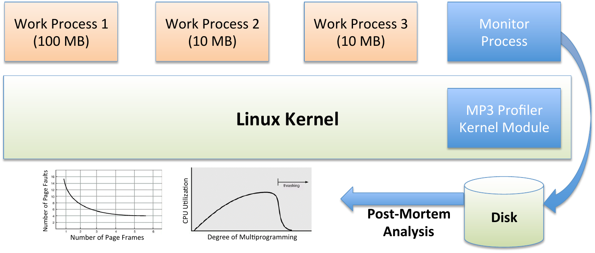
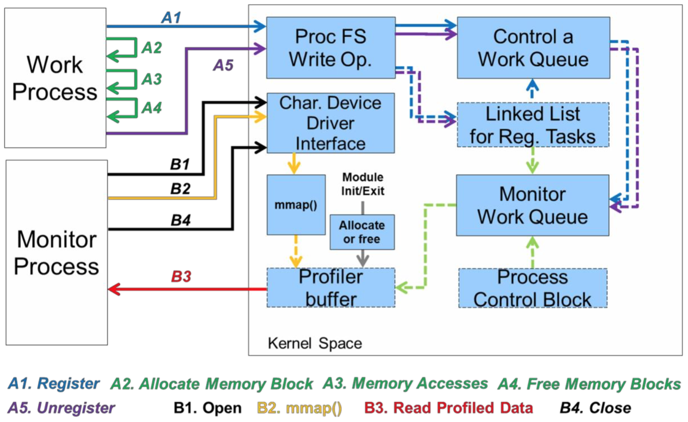

# CS423 Fall 2025 MP3: Virtual Memory Page Fault Profiler

**Assignment Due**: Nov. 20th at 11:59 PM CT

**Last Updated**: Nov. 14th

Table of Contents
- [CS423 Fall 2025 MP3: Virtual Memory Page Fault Profiler](#cs423-fall-2025-mp3-virtual-memory-page-fault-profiler)
  - [Before you start](#before-you-start)
    - [What you need](#what-you-need)
    - [Compile and Test Your Code](#compile-and-test-your-code)
  - [1 Goals and Overview](#1-goals-and-overview)
  - [2 Introduction](#2-introduction)
    - [3 Problem Description](#3-problem-description)
    - [4 Implementation Overview](#4-implementation-overview)
    - [5 Analysis](#5-analysis)
      - [5.1 Case Study 1: Thrasing and Locality.](#51-case-study-1-thrasing-and-locality)
      - [5.2 Case Study 2. Multiprogramming](#52-case-study-2-multiprogramming)
    - [6 Software Engineering](#6-software-engineering)
    - [7 Submission Instructions](#7-submission-instructions)
    - [8 Grading Criteria](#8-grading-criteria)
    - [9 References](#9-references)

## Before you start

### What you need

- You should have successfully completed MP1 and MP2. MP3 will use proc filesystem and list introduced in MP1.
- You should be able to read, write and debug program codes written in C language.
- (Recommended) You may have a code editor that supports Linux kernel module development - for example, VSCode, Neovim, or GNU Emacs (or Nano).
- (Recommended) You may use the [Linux Kernel Documentation](https://www.kernel.org/doc/html/v5.15/index.html) to search the Linux kernel documents for concepts and high-level descriptions.
- (Recommended) You may use the [Elixir Cross Referencer](https://elixir.bootlin.com/linux/v5.15.165/source) to search the Linux kernel codebase for function definitions and use cases.


### Compile and Test Your Code

You need to edit the Makefile to point to the correct kernel folder:

```Makefile
CFLAGS_MODULE += -Wno-declaration-after-statement -Werror
APP_CFLAGS = -std=c11 -pipe -O2 -Werror

KERNEL_SRC:= <PATH_TO_YOUR_5.15.165_KERNEL>
SUBDIR := $(PWD)

CC ?= gcc

.PHONY: clean

all: clean modules monitor work

obj-m:= mp3.o

modules:
	$(MAKE) -C $(KERNEL_SRC) M=$(SUBDIR) modules

monitor: monitor.c
	$(CC) $(APP_CFLAGS) $< -o $@

work: work.c
	$(CC) $(APP_CFLAGS) $< -o $@

clean:
	rm -f monitor work *~ *.ko *.o *.mod.c Module.symvers modules.order
```

For example:

```Makefile

KERNEL_SRC:= ~/linux-5.15.165

# everything else kept same
```

To test your kernel module, you can try loading, unloading, and running it in the MP0 VM. The following commands may be helpful:

```command
# inserting kernel module
insmod mp3.ko

# removing kernel module
rmmod mp3.ko

# print the kernel debug/printed messages
dmesg
```

## 1 Goals and Overview

- Understand the Linux virtual to physical page mapping and page fault rate.
- Design a lightweight tool that can profile page fault rate.
- Implement the profiler tool as a Linux kernel module.
- Learn how to use the kernel-level APIs for character devices, vmalloc(), and mmap().
- Test the kernel-level profiler by using a given user-level benchmark program.
- Analyze, plot, and document the profiled data as a function of the workload characteristics.

## 2 Introduction

Due to the ever growing performance gap between memory and hard disk, the management efficiency of the operating system virtual memory system becomes more important to the performance of the whole system. For example, inefficient replacement of memory pages can seriously harm the response time and the throughput of user-level programs.
In order to optimize the techniques used as a part of the virtual memory system, it is important to first understand the
behavioral characteristics of current virtual memory system for various types of user workloads.

Among the various metrics that can capture the virtual memory system behavior, the major and minor page fault
rates and CPU utilization of a user process are important metrics. Here, major page fault is a fault that is handled by
using a disk I/O operation (e.g., memory-mapped file), and minor page fault is a fault that is handled without using a
disk I/O operation (e.g., allocated by the malloc() function).

Page fault rate provides various kinds of useful information. For example, the page fault rate plotted as a function
of allocated memory size shows the thrashing effect. Increasing the degree of multiprogramming also shows how
increased page fault rate harms the utilization (or throughput) of the overall system.

In order to accurately measure such metrics (page fault count and CPU utilization), many profiling operations
are needed in a short time interval. Because such data are available only in the OS kernel address space, this would
cause a non-negligible performance overhead (e.g., switching contexts between user and kernel, copying data between
user/kernel address spaces), particular if the processor is implemented as a user space process.

This measurement overhead problem can be addressed by creating a shared buffer between the OS kernel and
user-level profiler process. Specifically,by mapping a set of physical pages allocated in the kernel space to the virtual
address space of the user-level process, the user-level process can access the data stored in the buffer without any
extra overhead other than accessing memory.


[](figs/mp3/figure1.png)
*Figure 1: Overview of MP3.*


Figure 1 gives an overview of this MP. A set of synthetic user-level work processes is created to emulate different
types of memory usage patterns (e.g., in terms of the used memory size and memory access locality). A monitor
process in user-level collects the page fault counts and utilization of the work processes and saves the collected data
to a file by using a pipe. The saved data stored in a regular file are then plotted to show the page fault rate and CPU
utilization as a function of the execution time. Finally, an analysis is done to explain the correlations between the
measured page fault rate and utilization, and the characteristics of the used work processes. 
The synthetic user-level program and the monitor program are provided as a part of this hand-out.
**The major focus of this MP3 is to build a kernel-level module that harvests the page fault and utilization information of registered tasks and exposes
them by using a memory buffer that is directly mapped into the virtual address space of the monitor process.**

### 3 Problem Description

In this MP, we will implement a profiler of page fault rate and CPU utilization for the Linux system. We will
implement this profiler in a Linux Kernel module and we will use the Proc filesystem, a character device driver, and
a shared memory area to communicate with user space applications. We will use a single Proc file-system entry
(`/proc/mp3/status`) for registering and unregistering monitored user-level processes. The Proc file is accessible
by any user. Our profiler should implement three operations available through the Proc file-system (similar to MP1 and MP2):

- Registration: This allows the application to notify the profiler kernel module its intent to monitor its page fault
    rate and utilization. This is done by sending a string formatted as `R <PID>`, where <PID> is PID of a process
    to monitor.
- Unregister: This allows the application to notify the profiler kernel module that the application has finished
    using the profiler. This is done by sending a string formatted as `U <PID>`.
- Read Registered Task List: Additionally, an application running in the system should be able to query which
    applications are registered. When the entry (`/proc/mp3/status`) is read by an application, the kernel
    module must return a list with the PID of each application.

Our profiler will use a character device to map the profiler buffer memory allocated in the kernel address space
to the virtual address space of a requesting user-level process. Our profiler will use the mmap operation to map the
kernel memory to the address space of a user-level process.

In this MP you are provided with a program that can run as a work process. This program is a single threaded
user-level application that allocates a request size of virtual memory space (e.g., up to 2GB) and accesses them with a
certain locality pattern (i.e., random or temporal locality) for a requested number of times. The access step is repeated
for 20 times. All these three parameters (i.e., memory size, locality pattern, and memory access count per iteration)
are provided as shell command line parameters. Using this interface, multiple instances of this program can be created
(i.e., forked) simultaneously.

### 4 Implementation Overview


In order to support this user-level application, the kernel module shall implement the following features:

1) The best way to start is by implementing an empty ("Hello World!") Linux Kernel Module. You should also be able
to reuse some of the most generic functions you implemented on MP1 and MP2, like linked list helper functions.

2) After this you should implement the Proc Filesystem entry. The write callback function should have a switch
to separate each type of message (REGISTRATION, UNREGISTRATION). We recommend to add an operation
character at the beginning and perform the switch operation over that character. This allows you to receive various
types of messages with a single Proc filesystem entry and provide a single unified interface. As an example we show
the string formats for each the Proc Filesystem messages:

- For Registration: `R <PID>`
- For Unregistration: `U <PID>`

3) [optional] You should augment the Process Control Block (PCB). This created PCB shall include three variables to keep the
process utilization (u_time and s_time), major fault count, and minor fault count of the corresponding process. To
obtain those numbers we have provided you with a helper function in `mp3_given.h`.

4) Now you need to implement registration and unregistration functions. The registration function first adds the requesting process to the PCB list and calls a function that creates a work queue job if the requesting process is the
first one in the PCB list. Similarly, the unregister function deletes the requesting process from the PCB list (if exists).
Then, if the PCB list is empty after the delete operation, the work queue job is deleted as well.

5) A memory buffer is allocated in the kernel memory when your kernel module is initialized and is freed when the
module is uninitialized. The buffer needs to be virtually contiguous, but does not have to be physically contiguous.
This means `vmalloc()` kernel function can be used instead of `kmalloc()` for this operation. As physically
contiguous memory is scarce, **we require you to use `vmalloc()` as part of this MP.** The buffer memory size shall
be larger than or equal to 128 x 4 KB. In order to disable management of allocated pages by the virtual memory
system, the PG_reserved bit needs to be set. You may want to initialize the buffer with -1 which is expected initial value
from `monitor` program introduced later.

1) Your kernel module will use a delayed work queue <!-- (alternatively you can use a timer and a kernel thread) --> that
periodically measures the major and minor page fault counts, and CPU utilization of all registered user processes
and saves the measured information to the memory buffer. We have provided the function `get_cpu_use()` in
`mp3_given.h` that returns the number of major and minor page faults and CPU utilization in expressed in jiffies.
The values returned are the statistics between the previous and the current invocation of `get_cpu_use()` for the
requested process.

    The sampling rate of the profiler must be 20 times per second. This means our work handler must be executed 20
    times per second by the work queue. The memory buffer is organized as a queue that saves up to 12000 (=20x600)
    samples. Each sample consists of four `unsigned long` type data: 
    (a)`jiffies` value (which is the Linux kernel
    variable that shows the number of timer ticks executed since the kernel boot-up), 
    (b) minor fault count, 
    (c) major fault count, 
    and (d) CPU utilization (`s_time` + `u_time`). The work handler only writes one sample each time. 
    In each sample, (b), (c), and (d) are the sum of that of all the registered processes **within a sampling period (1/20 seconds)**.

1) Your kernel module should use a **character device driver** to allow user-level process to map the shared memory
buffer to its address space. Only three callback functions of the Linux character device driver are used: `open`,
`close`, and `mmap`; where open and close callback handlers are defined as empty functions (i.e., function defined
but does not have any valid statement to execute).

    To create a character device, you first need to use `register_chrdev_region()` to register a range of device
    numbers. In MP3, you should use 423 as the major number of your character device and 0 as the minor number of
    your character device.

    In order to access this character device from user-level process, a file needs to be created (i.e., as device is represented
    as a file in UNIX-like OS). The following shell command can be used to create this file which is named as `node`.

    ```
    $ insmod mp3.ko
    $ cat /proc/devices
    <check the created device’s major number>
    $ mknod node c 423 0
    ```
1) The buffer memory is mapped into the virtual address space of a user process upon request (i.e., by the mmap()
callback). This is done by mapping the physical pages of the buffer to the virtual address space of a requested
user process. For each page of the buffer, the following two kernel functions are used. First, the `vmalloc_to_pfn(virtual_address)` is used to get the physical page address of a virtual page of the buffer. Second,
`remap_pfn_range()` is used to map a virtual page of a user process to a physical page (which is obtained by
the previous function).
This is requested by a user-level process when the process executes the `mmap()` function on the character device of
the kernel module. This implies this mapping shall be done for the range of virtual address space that is passed as
parameters of the request of the user process.

### 5 Analysis

For the first and second case studies described in this section, all requested graphs need to be plotted in the docu-
ment. The graph shall be self-contained (i.e., accurately specifying the experimental configurations). Note that if the
implementation of your kernel module conveys the specification of this handout, the sampling rate of data plotted in
the graphs is 20 samples per second. For any characteristics related to the concepts taught in the VM lectures and
any abnormal (non-intuitive) characteristics observed, please describe your analyses such that clearly explain what
are the underlying reasons of the observed characteristics and what are the implications for optimizing the system
performance.

[](figs/mp3/figure2.png)

*Figure 2: MP3 Software Architecture*
#### 5.1 Case Study 1: Thrasing and Locality.

In this case study we will try to understand the page fault rate and CPU utilization as a function of the used memory
size and the memory locality. The following parameters are used for the two work processes.

Work process 1: 1024MB Memory, Random Access, and 50,000 accesses per iteration

Work process 2: 1024MB Memory, Random Access, and 10,000 accesses per iteration


The shell command to run these work processes and the command to store the profiled data are:

```
$ nice ./work 1024 R 50000 & nice ./work 1024 R 10000 &
... <after completing the two processes>
$ ./monitor > profile1.data
```

Plot a graph named `case_1_work_1_2.png` where x-axis is the time and y-axis is the accumulated page fault count (accumulated since the start) of the two work processes
(work processes 1 and 2). Note that if the MP3 kernel module is properly implemented as specified in this handout,
each of the profiled page fault count sample represents the number of page faults occur ~~during in every 20 milliseconds of interval~~ in each sampling interval (sampling rate = 20 times per second).

Then, conduct another experiment by using following two work processes.

Work process 3: 1024MB Memory, Random Locality Access, and 50,000 accesses per iteration

Work process 4: 1024MB Memory, Locality-based Access, and 10,000 accesses per iteration


The shell commands for this case study are:
```
$ nice ./work 1024 R 50000 & nice ./work 1024 L 10000 &
... <after completing the two processes>
$ ./monitor > profile2.data
```

Plot another graph named `case_1_work_3_4.png` where x-axis is the time and y-axis is the accumulated page fault count of the two work processes (work processes 3 and 4).
Analyze the quantitative differences between these two graphs and discuss where such differences come from.
Both the page fault rate and the completion time of the work processes are points of interests in this analysis.

#### 5.2 Case Study 2. Multiprogramming

In this case we will analyze the CPU utilization as a function of the degree of multiprogramming. The following
parameters are used for the work process 5. We will use N instances of the work process 5 for this study.

Work process 5: 200MB Memory, Random Locality Access, and 10,000 accesses per iteration

Plot a graph named `case_2.png` where x-axis is N (i.e., 5, 11, 16, 20, 22/25 **(Updated Nov. 14: x86 uses 22, ARM uses 25)**) and y-axis is the total utilization of all N copies of the work
process 5.
Analyze the quantitative differences between these ~~three~~ data points (where N is 5, 11, 16, 20, 22) and discuss where
such differences come from. Both the utilization and the completion time of the work processes are points of interests
in this analysis.

Please clearly state that you used ARM-based system in your README file.

**Setting up swap space**

If you found some processes get killed by OOM when N gets larger or never observed a major page fault, 
    it's likely that you haven't setup a swap space.
`cs423-q` doesn't have that enabled by default.
To check if you have swap space, run `free` inside QEMU VM and look for `Swap` size.

**Setup for x86-64**

Here's a guideline on how to setup swap space,
```bash
# outside QEMU VM
# create a image for swap device of 2G
qemu-img create -f qcow2 swap.qcow2 2G
```

Edit your qemu script line 247: (the field `qemu-system-x86_64`)'s last line: `-append "$cmdline" -s` to have a symbol to continue the line, and add `-drive file=<path to your img file you created>,if=ide` with a new line under it.

When you launch the QEMU VM with the new script, a virtual device `/dev/sda` should appear.
Next, we setup the swap device.

```bash
# inside QEMU VM
# you can also put these two lines in guest function of cs423-q 
# so that you don't need to type it every time when booting a QEMU VM.
mkswap /dev/sda
swapon /dev/sda
```

**Setup for AArch64 (Updated Nov. 14)**

1. We have updated the q-script. Please pull the q-script repository again. Go to your `qemu-script` folder, and run `git pull`.
2. Create the swap disk image. In the `qemu-script` folder, run `qemu-img create -f raw swap.raw 2G`.
3. We now need to recompile the kernel. Go to your `linux-5.15.165` folder, run the following:

```
scripts/config --enable CONFIG_VIRTIO_BLK
make olddefconfig
make -j`nproc`
```

4. Boot with an extra drive attached. Run `EXTRA_DRIVE=../qemu-script/swap.raw ../qemu-script/cs423-q`, which `EXTRA_DRIVE` is the swap disk path. Adjust if necessary.
5. You have now booted the kernel. Run the following to enable swap:

```
mkswap /dev/vda
swapon /dev/vda
```

6. Check if the swap is enabled. If `Swap` shows 2047 instead of 0, that means you have successfully enabled swapping.

```
root@q:/home/paizhang/linux-5.15.165# free -m
               total        used        free      shared  buff/cache   available
Mem:            3925         115        3871           0          18        3810
Swap:           2047           0        2047
```

7. **To better observe thrashing, please use 25 instead of 22 in the case study 2.** Please clearly state that you used ARM-based system in your README file.

### 6 Software Engineering

Your code should include comments where appropriate. It is not a good idea to repeat what the function does us-
ing pseudo-code, but instead, provide a high-level overview of the function including any preconditions and post-
conditions of the algorithm. Some functions might have as few as one line comments, while some others might have
a longer paragraph. Also, your code must be split into small functions, even if these functions contain no parameters.
This is a common situation in kernel modules because most of the variables are declared as global, including but not
limited to data structures, state variables, locks, timers and threads.

An important problem in kernel code readability is to know if a function holds the lock for a data structure or
not, different conventions are usually used. A common convention is to start the function with the character ‘_’ if the
function does not hold the lock of a data structure.

In kernel coding, performance is a very important issue, usually the code uses macros and preprocessor commands
extensively proper use of macros and identifying possible situations where they should be used is important in kernel
programming.

Finally, in kernel programming, the use of the goto statement is a common practice. A good example of this, is
the implementation of the Linux scheduler function schedule(). In this case, the use of the goto statement improves
readability and/or performance. “Spaghetti code” is never a good practice!

### 7 Submission Instructions

We will follow a similar submission procedure as we did in the previous MP.


1) Open the link https://classroom.github.com/a/V5g52O1A login using your GitHub account.

2) Find your name in the student list and click it to accept the assignment. Please double-check your name and email address before accepting the assignment (If you choose other’s name by mistake, please contact TA)..

3) A repo named `cs423-uiuc-fall25/mp3-<your github id>` will be automatically created for you with the starter code in it.

4) Your kernel module must be compiled to `mp3.ko`, and your test application must be compiled to userapp.
Push your codeandplots to your repo before the deadline. Put plots under a `plots` folder and name them as mentioned in section 5.

1) As what we did in MP1, please also write a README file to briefly describe how you implement the functionalities and analyze the results from case study 1 and 2. If you have some special implementation you think worth
mentioning, please also include that.

Please upload the README to your GitHub repo with filename `README.md`.

### 8 Grading Criteria

| **Criterion** | **Points** |
|:--------------|:----------:|
| Read and Write Proc filesystem callbacks parsing the three commands | 5 |
| Correct Implementation of the profiler buffer allocation and free | 10 |
| Correct Implementation of the work queue (e.g., delayed execution) | 5 |
| Correct Implementation of the work queue handler function (e.g., lock) | 10|
| Correct Implementation of the character device (open, close, node file) |  10 |
| Correct Implementation of the mmap() of the profiler buffer | 25 |
| Graphs and logical analysis for the case study 1 | 10 |
| Graphs and logical analysis for the case study 2 | 10 |
| Document Describing the implementation details and design decisions | 5|
| Your code compiles and runs correctly and does not use any Floating Point arithmetic. | 5 |
| Your code is well commented, readable and follows software engineering principles. | 5 |
| **Total** | **100** |


### 9 References

1. Workqueue interface and documentation, https://elixir.bootlin.com/linux/v5.15.165/source/include/linux/workqueue.h
2. Char device interface, https://elixir.bootlin.com/linux/v5.15.165/source/include/linux/cdev.h and its file operations
   https://elixir.bootlin.com/linux/v5.15.165/source/include/linux/fs.h#L2011
3. vmalloc, https://elixir.bootlin.com/linux/v5.15.165/source/include/linux/vmalloc.h#L146
4. Get page frame number from vmalloc, https://elixir.bootlin.com/linux/v5.15.165/source/include/linux/mm.h#L775
5. Remap pfn, https://elixir.bootlin.com/linux/v5.15.165/source/include/linux/mm.h#L2800

<!-- 6. Character device registration (new interface for Linux v2.6),http://www.makelinux.net/ldd3/chp-3sect-
7. Linux kernel module programming, Chapter 4 Character Device Drivers (an old interface), Available athttp:
    //tldp.org/LDP/lkmpg/2.6/html/x569.html
8. Linux Device Driver, Chapter 15 Memory Mapping and DMA, Available athttp://www.davehylands.com/
    Misc/Linux-Device-Drivers-3rd-Edition.pdf
9. Work Queue Tutorial 1,http://www.linuxjournal.com/article/6916?page=0,


5. Work Queue Tutorial 2,http://www.ibm.com/developerworks/linux/library/l-tasklets/index.
    html
6. Linux Kernel Programming Slides on Class Website
7. The Linux Kernel Module Programming Guide,http://tldp.org/LDP/lkmpg/2.6/html/index.html
8. Linux Kernel Linked List Explained,http://isis.poly.edu/kulesh/stuff/src/klist/
9. Kernel API’s Part 3: Timers and lists in the 2.6 kernel,http://www.ibm.com/developerworks/linux/
    library/l-timers-list/
10. Access the Linux Kernel using the Proc Filesystem,http://www.ibm.com/developerworks/linux/
library/l-proc/index.html
11. Linux kernel threads-a simple introduction,http://kerneltrap.org/node/
12. Love Robert, Linux Kernel Development, Chapters 3, 4, 6, 9-11, 17-18, Addison-Wesley Professional, Third Edition -->


